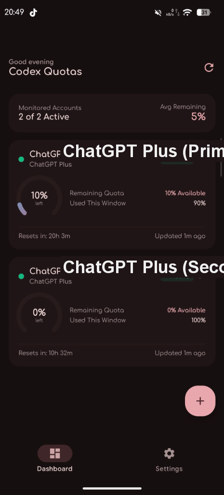
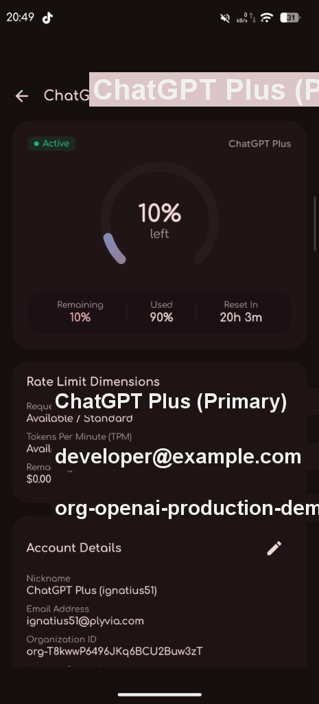
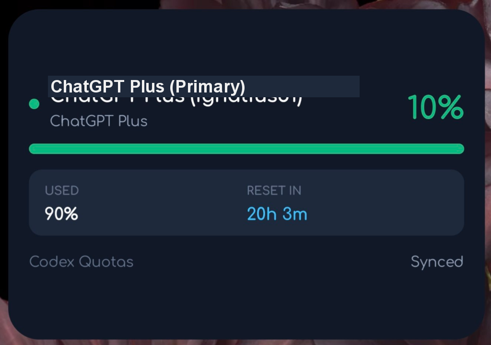

<div align="center">

# ⚡ Codex Quota Monitor for Android

**A modern, privacy-first Android client to monitor real-time OpenAI Codex and ChatGPT Plus/Team quotas, rate limits, and subscription renewal schedules across multiple accounts.**

[](https://github.com/boudywho/codex-quota-android/releases)
[-3DDC84?style=for-the-badge&logo=android&logoColor=white)](https://developer.android.com)
[](https://kotlinlang.org)
[](https://developer.android.com/jetpack/compose)
[](LICENSE)

<br/>

<p align="center">
  
  &nbsp;&nbsp;&nbsp;&nbsp;
  
  &nbsp;&nbsp;&nbsp;&nbsp;
  
</p>

</div>

---

## ✨ Features

### 🔄 Real-Time Quota & Rolling Limits
- **Live Subscriber Rate Limits**: Directly queries OpenAI's real-time rate limit engines to display accurate `Used %` and `Remaining %` on active ChatGPT Plus, Team, and Enterprise accounts.
- **Dynamic Reset Countdown**: Real-time timers showing the exact duration until rate limit windows roll over.
- **Platform API Keys**: Tracks token-per-minute (TPM) and request-per-minute (RPM) limits with detailed metric meters.

### 🔑 Seamless Device Code Authorization
- **Official Codex Flow**: Sign in using standard OAuth device authorization (`https://auth.openai.com/codex/device`) with automatic PKCE exchange.
- **Zero API Key Leakage**: No need to generate raw API secrets or manage complex tokens manually.

### 📅 Subscription Expiration & Renewal Tracking
- **Renewal Timers**: View exact renewal and expiry dates, billing cycles (monthly/yearly), and auto-renewal statuses.
- **Account Metadata**: View account registration dates, linked emails, and workspace IDs.

### 📱 Android Home-Screen Widgets
- **Jetpack Glance**: Modern, responsive Material 3 home-screen widgets providing real-time quota gauges and reset timers directly on your launcher.

### 🛡️ Enterprise-Grade Security & Privacy
- **Hardware-Backed Keystore**: All credentials and tokens are encrypted on-device via **AES-256-GCM** backed by the Android Keystore system.
- **Zero Telemetry**: Completely tracker-free with zero third-party analytics or remote logging.
- **Direct HTTPS**: App communicates exclusively with OpenAI servers with no intermediate proxies.

---

## 📥 Download & Installation

Grab the latest APK directly from the GitHub Releases:

👉 **[Download Latest APK (GitHub Releases)](https://github.com/boudywho/codex-quota-android/releases/latest)**

1. Download `codex-quota-vX.X.X.apk` onto your Android device.
2. Open the file to install (allow "Install from Unknown Sources" if prompted).
3. Launch **Codex Quotas** and tap `+` to add your first account!

---

## 🏗️ Architecture & Technology Stack

Codex Quota is built according to official **Modern Android Architecture** and Clean Architecture guidelines:

```
app/
├── auth/          # OAuth PKCE Device Code Flow & JWT Token Parsers
├── data/
│   ├── local/     # Room Database, Encrypted Keystore Storage, Preferences DataStore
│   └── remote/    # OkHttp / Kotlinx Serialization, OpenAI Wham & Platform APIs
├── domain/        # Use Cases, Repository Interfaces, Models & Enums
├── ui/
│   ├── components/# Circular gauges, Progress bars, Metric cards
│   ├── feature/   # Dashboard, Account Detail, Add Account, Settings, About
│   ├── navigation/# Jetpack Compose Type-Safe Navigation
│   └── theme/     # Material 3 Color Schemes, Typography & Shapes
├── widget/        # Jetpack Glance Home Screen Widgets
└── worker/        # AndroidX WorkManager for background synchronization & alerts
```

- **UI Framework**: Jetpack Compose with Material Design 3 and Dynamic Colors (Material You)
- **Asynchronous Flow**: Kotlin Coroutines & `StateFlow`
- **Dependency Inversion**: Factory-based ViewModels and Clean Repository Pattern
- **Local Persistence**: Room SQLite + AndroidX Security EncryptedSharedPreferences (AES-256-GCM)
- **Background Tasks**: AndroidX WorkManager periodic sync & system notifications
- **Home Widgets**: Jetpack Glance AppWidget

---

## 🛠️ Building From Source

### Prerequisites
- JDK 17 or JDK 21
- Android Studio Ladybug (2024.2.1+) or Gradle 8.11+
- Android SDK Platform 35

### Clone & Build
```bash
# Clone the repository
git clone https://github.com/boudywho/codex-quota-android.git
cd codex-quota-android

# Run unit tests
./gradlew test

# Assemble Debug APK
./gradlew assembleDebug

# Output APK location:
# app/build/outputs/apk/debug/app-debug.apk
```

---

## 🔒 Security & Privacy

| Principle | Implementation |
| :--- | :--- |
| **Credential Storage** | Android Keystore Hardware-Backed AES-256-GCM |
| **Network Security** | Direct TLS 1.3 HTTPS exclusively to `openai.com` / `chatgpt.com` |
| **Data Collection** | **Zero**. No analytics, no crashlytics, no tracking cookies. |
| **Cloud Backups** | Excluded from Android Auto-Backup (`allowBackup=false`) |

---

## ⚖️ Legal Disclaimer

Codex Quota is an independent, open-source project developed for developers and power users to monitor their personal API usage and subscription windows.

* This application is **not** created, affiliated with, authorized, maintained, sponsored, or endorsed by OpenAI, Inc.
* OpenAI, ChatGPT, Codex, and GPT are trademarks or registered trademarks of OpenAI, Inc.

---

## 📄 License

Distributed under the **MIT License**. See [`LICENSE`](LICENSE) for more information.
