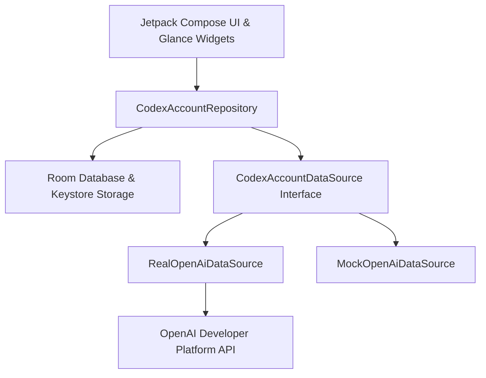

# OpenAI & Codex Integration Analysis

This document outlines the official developer interfaces, architectural findings, and security determinations regarding OpenAI Codex and OpenAI Developer Platform usage monitoring.

---

## 1. Executive Summary & Status

| Interface Dimension | Status | Notes |
|---|---|---|
| **Consumer ChatGPT/Codex Subscription Quota API** | **Not Publicly Available** | OpenAI does *not* provide a public OAuth2 device authorization grant or public REST API for personal ChatGPT Plus/Team/Enterprise rolling message limit quotas (e.g. 50 messages / 3 hours). |
| **Legacy Codex API (`code-davinci-002`)** | **Deprecated** | Deprecated by OpenAI on March 23, 2023. |
| **OpenAI Developer Platform API Key Auth** | **Fully Supported** | Supported via standard Bearer token authorization against `https://api.openai.com/v1/*`. |
| **Real-Time Rate-Limit / Quota Headers** | **Fully Supported** | Every authenticated request returns live HTTP response headers: `x-ratelimit-remaining-requests`, `x-ratelimit-reset-requests`, `x-ratelimit-remaining-tokens`, `x-ratelimit-reset-tokens`. |
| **Organization Usage & Costs API** | **Fully Supported** | Organization Admin API keys can query aggregated usage via `GET /v1/organization/usage/completions`, `/v1/organization/costs`, etc. |
| **Key Validation & Status Check** | **Fully Supported** | `GET /v1/models` validates authentication, organization bindings, and active tier permissions. |

---

## 2. Integration Policy & Security Mandate

In strict accordance with project security guidelines:
- **No Unofficial Scrapers or Browser Automation**: We do not scrape ChatGPT web interfaces, replay browser sessions, or simulate hidden browser logins.
- **No Password Interception**: Passwords are never collected or stored.
- **No Reverse-Engineered Undocumented Endpoints**: Undocumented endpoints like `chatgpt.com/backend-api/*` rely on Cloudflare session tokens and violate OpenAI terms of service; they are strictly excluded.
- **Android Keystore Hardware Security**: All user-provided API tokens are encrypted with AES-GCM-256 backed by the Android Keystore system.

---

## 3. Implemented Architecture

The application adopts a clean, decoupled Data Source and Repository architecture:

### Supported Remote Sources:
1. **`RealOpenAiDataSource`**:
   - Queries `GET https://api.openai.com/v1/models` to validate token authenticity.
   - Extracts real-time rate limit headers:
     - `x-ratelimit-limit-requests`
     - `x-ratelimit-remaining-requests`
     - `x-ratelimit-reset-requests` (e.g. `20ms`, `1s`, `3m20s`)
     - `x-ratelimit-limit-tokens`
     - `x-ratelimit-remaining-tokens`
     - `x-ratelimit-reset-tokens`
   - Maps HTTP 401 / 403 to `AUTHENTICATION_REQUIRED`.
   - Maps HTTP 429 to `TEMPORARY_ERROR` / rate-limited state.
   - Maps network IO failures to `OFFLINE` (preserving cached data).

2. **`MockOpenAiDataSource`**:
   - Provides rich, deterministic profiles for testing and local development:
     - **Personal (ChatGPT Plus)**: 78% remaining, resets in 2h 15m.
     - **Work (OpenAI Team / Enterprise)**: 34% remaining, resets tomorrow 10:00 AM.
     - **Secondary API Key (Tier 2)**: 92% remaining, $120.00 credits left.
     - **Rate Limited Key**: 0% remaining, 429 response simulation.
     - **Signed-Out Account**: 401 unauthorized transition simulator for testing notifications.

---

## 4. Future Public Consumer OAuth Migration Path

When OpenAI publishes an official OAuth2 Device Authorization Grant and public Quota API for consumer subscription accounts:
1. Implement the OAuth2 device grant in `com.codex.quota.auth.OAuthManager`.
2. Implement the new endpoint in `com.codex.quota.data.remote.ConsumerCodexDataSource`.
3. Bind the new source into `CodexAccountRepositoryImpl` without modifying any UI or widget code.
